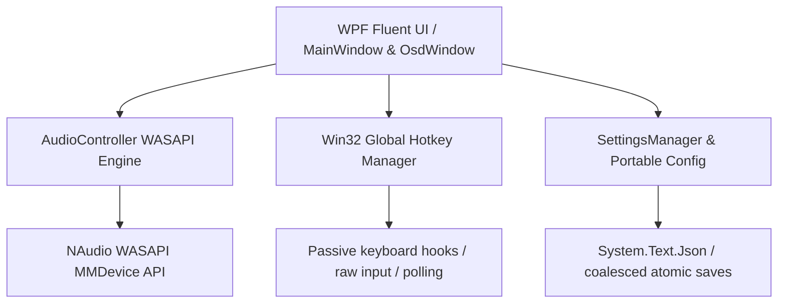

<div align="center">

# 🎙️ MicMute

**A modern, lightweight Windows 11 utility for instant microphone control with global hotkeys, high-refresh-rate animations, and a sleek On-Screen Display (OSD).**

[](https://github.com/youssefhazem3-dot/MicMute)
[](https://dotnet.microsoft.com/)
[](LICENSE)
[](https://github.com/youssefhazem3-dot/MicMute/releases)
[](https://github.com/youssefhazem3-dot/MicMute/raw/main/MicMute.zip)

<br />

[Features](#-key-features) • [Installation](#-installation--downloads) • [Latest Fixes](#-latest-bugs-fixed) • [Building](#-building-from-source) • [Architecture](#-architecture--tech-stack) • [Configuration](#-data-storage--portable-mode)

</div>

---

## 🌟 Overview

**MicMute** is a native Windows desktop application for gamers, streamers, professionals, and remote workers who need responsive microphone control. Built in C# and WPF with Windows audio (WASAPI) integration, MicMute provides global shortcuts and a Fluent Design interface.

---

## ✨ Key Features

| Feature | Description |
| :--- | :--- |
| **🎙️ Global Hotkeys** | Observe custom modifier and key combinations while preserving their normal action in the foreground app. Some protected games may restrict input monitoring. |
| **🖥️ Fluent OSD Popup** | Non-intrusive On-Screen Display with customizable display duration (`0.1s – 30.0s`), preloaded to reduce first-toggle work. |
| **🎨 Dark & Light Modes** | Fully adaptive modern color schemes with frosted glass accents, subtle glows, and high-contrast accessibility. |
| **⚡ High Refresh Rate** | WPF animation frame rate configured from the primary display at startup, with native window dragging. |
| **🎛️ WASAPI Audio Control** | Hardware-level audio endpoint control using NAudio WASAPI with automatic device hotplug detection. |
| **🪟 Windows 11 Native Controls** | Seamless integration with Windows 11 caption buttons (minimize, close) and rounded corners. |
| **🚀 System Tray Integration** | Minimize to tray, start on Windows login, and receive unobtrusive notifications. |
| **📁 Flexible Storage & Portable Mode** | Choose your settings directory or place `portable.flag` next to the executable for a 100% portable flash drive setup. |

---

## 🐛 Latest Bugs Fixed

Here is a concise summary of the latest stability improvements and fixes:

* **Stuck Hotkeys Fixed:** Resolved an issue where rapid presses or dropped native release events caused shortcuts to become unresponsive or stuck.
* **Generic Modifier Support:** Full compatibility with generic `Ctrl`, `Shift`, and `Alt` virtual keys across Remote Desktop, virtual machines, and mouse/macro software.
* **Instant Mute/Unmute Response:** Removed UI thread latency during volume state updates so the tray icon and toggle respond immediately.
* **Comprehensive Device Fallback:** Added automatic audio capture endpoint fallback across all Windows roles (`Communications`, `Console`, `Multimedia`).
* **OSD Multi-Monitor & DPI Fix:** Eliminated screen jumping and display flickering on launch; added per-monitor DPI coordinate scaling.
* **Safer Shortcut Recording:** Pressing `Escape` now cleanly cancels shortcut recording, and core typing/navigation keys (`Tab`, `Enter`, `Space`, `Backspace`, `CapsLock`) are protected from accidental binding.
* **No UI Freezing on Device Hotplug:** Headset connection/disconnection device enumeration now runs asynchronously in the background.
* **GPU Spikes & Performance Lag Fixed:** Eliminated high GPU utilization (spiking up to 70%) caused by continuous pixel shader blur operations and infinite animation loops on transparent layered surfaces. Replaced with efficient vector radial gradient rendering and clamped the maximum UI animation rate to 120 FPS.
* **Single Standalone Executable:** Packaged into a single self-contained `.exe` with zero external runtime requirements (no .NET 8 desktop runtime installation needed).

---

## 🚀 Installation & Downloads

### Option 1: Standalone Single-File Executable (Recommended)

[](https://github.com/youssefhazem3-dot/MicMute/raw/main/MicMute.zip)

1. Download **[`MicMute.zip`](https://github.com/youssefhazem3-dot/MicMute/raw/main/MicMute.zip)** or the standalone **`MicMute.exe`** directly.
2. Extract or place `MicMute.exe` anywhere on your system.
3. **No runtime required:** MicMute is 100% self-contained into a single `.exe` file. You do **not** need to install the .NET 8 Desktop Runtime or keep extra DLL/JSON files around!
4. Double-click `MicMute.exe`. It starts in the tray by default; double-click the tray icon to open the panel, or run `MicMute.exe --show`.

### Option 2: Clone & Build
```powershell
# Clone the repository
git clone https://github.com/youssefhazem3-dot/MicMute.git

# Navigate into the project directory
cd MicMute

# Requires the .NET 8 SDK on PATH (or in .tools/dotnet/)
.\scripts\build.ps1
.\scripts\test.ps1 -NoRestore

# Build the distributable ZIP and refresh the root executable
.\scripts\publish.ps1 -NoRestore -UpdateRoot
```

---

## 🛠️ Architecture & Tech Stack



* **Language & Framework:** C# 12 / .NET 8 (`net8.0-windows`)
* **UI Subsystem:** Windows Presentation Foundation (WPF) with pure GUI subsystem (`IMAGE_SUBSYSTEM_WINDOWS_GUI`)
* **Audio Layer:** NAudio 2.2.1 WASAPI Core Audio Endpoint API
* **Window Styling & Native Hooks:** Win32 P/Invoke APIs (`RegisterWindowMessage`, `SetForegroundWindow`, keyboard hooks and raw input)

---

## 📁 Data Storage & Portable Mode

MicMute gives you complete control over your application data:

1. **Standard AppData Mode (Default):** Settings and cache are safely stored under `%APPDATA%\MicMute\settings.json`.
2. **Custom Location:** Easily change the storage directory directly from the **Data & Storage Location** card in the UI.
3. **Portable Mode:** Create an empty file named `portable.flag` or place `settings.json` directly in the application folder. MicMute will store settings there. Startup and administrator preferences still use Windows registry entries.

---

## 🗂️ Project Structure

```
e:\MicMute\
├── App.xaml / App.xaml.cs             # Application lifecycle, mutex & AssemblyResolve hooks
├── MainWindow.xaml / .cs              # Primary Fluent UI control panel & animations
├── OsdWindow.xaml / .cs               # Floating On-Screen Display window
├── AudioController.cs                 # WASAPI audio endpoint enumeration & volume management
├── HotkeyManager.cs                   # Passive keyboard hooks, raw input & polling
├── SettingsManager.cs                 # Cached settings backed by SettingsStore/SettingsCodec
├── StartupManager.cs                  # Windows registry run-on-startup integration
├── ThemeManager.cs                    # Dynamic Dark/Light theme brush provider
├── AssemblyInfo.cs                    # Application metadata and version attributes
├── app.ico                            # High-resolution multi-size application icon
├── MicMute.csproj                     # .NET project configuration
└── MicMute.sln                        # Visual Studio Solution
```

---

## ⌨️ Default Controls

| Action | Default Shortcut | Configurable |
| :--- | :--- | :--- |
| **Toggle Microphone Mute** | `F1` | ✅ Yes (Click **Record**) |
| **Dismiss OSD** | Auto-timed (`1.5s` default) | ✅ Yes (`0.1s – 30.0s`) |
| **Open Control Panel** | Double-click Tray Icon | — |
| **Restore Running Instance** | Re-run `MicMute.exe` | — |

---

## 🤝 Contributing

Contributions, issues, and feature requests are welcome!
Feel free to check the [issues page](https://github.com/youssefhazem3-dot/MicMute/issues).

1. Fork the Project
2. Create your Feature Branch (`git checkout -b feature/AmazingFeature`)
3. Commit your Changes (`git commit -m 'Add some AmazingFeature'`)
4. Push to the Branch (`git push origin feature/AmazingFeature`)
5. Open a Pull Request

---

## 📄 License

Distributed under the MIT License. See `LICENSE` for more information.

<div align="center">
<sub>Crafted with precision for Windows 11.</sub>
</div>
