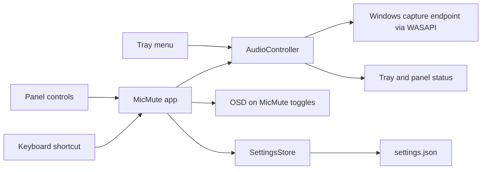

# MicMute

MicMute is a Windows desktop utility for toggling a microphone's mute state from the control panel, notification-area icon, or a configurable keyboard shortcut.

[Download the latest build](https://github.com/youssefhazem3-dot/MicMute/raw/main/MicMute.zip) · [Report an issue](https://github.com/youssefhazem3-dot/MicMute/issues)

 

MicMute changes the mute state of a Windows audio capture device through WASAPI. It does not record or save microphone audio.

## Quick start

1. Download and extract `MicMute.zip`.
2. Run `MicMute.exe`. The release package contains one self-contained `win-x64` executable and does not require a separate .NET Desktop Runtime installation.
3. Use the large microphone button or press **F1** to toggle mute. The app also adds an icon to the notification area.

The control panel opens on launch by default. **Start Minimized** or the `--minimized` argument starts MicMute with the panel hidden in the notification area. The title-bar minimize button minimizes the window; the close button hides it to the notification area. Double-click the tray icon to reopen the panel. Right-click it for **Toggle Mute**, **Open App**, and **Quit**.

If MicMute is already running, launching it again brings the existing window forward. Use `--show` to open the panel even when **Start Minimized** is enabled.

## Interface and appearance

The panel is organized around a prominent microphone toggle and status indicator, with grouped controls for the input device, shortcut, OSD, sound effects, launch behavior, and settings location. Dark mode is the default; use the theme button in the title bar to switch to light mode.

The optional OSD is a compact circular status overlay. It shows **ACTIVE** or **MUTED** with a microphone icon; the muted state uses a coral-red slash. The overlay follows the selected theme.

## Using MicMute

### Microphone and shortcut

- Choose an active capture device from **Microphone Input**. The device list refreshes when Windows reports a device change.
- Press **Record** under **Shortcut Key**, then enter the key combination to use. The default shortcut is **F1** with no modifiers.
- MicMute observes the shortcut while leaving its normal key action available to the foreground app.
- You can also toggle mute from the main button or the tray menu.

Some elevated apps and protected games restrict global keyboard input. **Run as Administrator** can help with elevated windows, but anti-cheat software may still block shortcuts.

### OSD and sound effects

- The OSD is enabled by default and stays visible for **1.5 seconds**. Turn it off or set a duration from **0.1 to 30 seconds** in the panel.
- Sound effects are off by default. Enable them to play a built-in chime when MicMute toggles mute, then set the volume from **0% to 100%**.

### Launch and appearance settings

- **Run on Windows Startup** adds or removes MicMute from the current user's startup apps.
- **Start Minimized** launches MicMute with its window hidden in the notification area.
- **Run as Administrator** can improve shortcut compatibility with elevated apps and may require a restart to take effect.
- The title-bar theme button switches between dark and light modes.

## Settings and portable mode

By default, MicMute stores its settings in `%APPDATA%\MicMute\settings.json`. Use the **Settings Location** controls to open that folder, move settings to a custom folder, or reset settings.

To keep settings beside the executable, place an empty `portable.flag` file next to `MicMute.exe` before starting MicMute. A `settings.json` file beside the executable also selects that folder. Portable mode applies to MicMute's settings; Windows startup and administrator integration still use current-user Windows settings.

## Build from source

Building requires the .NET 8 SDK on Windows. From PowerShell:

```powershell
git clone https://github.com/youssefhazem3-dot/MicMute.git
cd MicMute

.\scripts\build.ps1
.\scripts\test.ps1
.\scripts\publish.ps1 -UpdateRoot
```

The publish script runs the test suite, creates the self-contained single-file executable and `MicMute.zip`, and updates the `publish` folder. `-UpdateRoot` also refreshes the root-level `MicMute.exe`.

## Architecture



MicMute uses C# 12, WPF, .NET 8 for Windows, and NAudio 2.2.1. The shortcut listener combines a low-level keyboard hook, raw input, and polling so key presses remain available to the foreground app.

## Project files

| Area | Files |
| --- | --- |
| App startup, tray, and single-instance behavior | `App.xaml.cs`, `AppInstanceMutex.cs` |
| Main control panel and OSD | `MainWindow.xaml`, `MainWindow.xaml.cs`, `OsdWindow.xaml`, `OsdWindow.xaml.cs` |
| Audio devices and mute state | `AudioController.cs`, `AudioDevice.cs`, `AudioMuteState.cs`, `AudioWorkQueue.cs` |
| Keyboard shortcuts | `HotkeyManager.cs`, `HotkeyState.cs`, `RawKeyboardPacket.cs` |
| Settings and persistence | `AppSettings.cs`, `SettingsManager.cs`, `SettingsStore.cs`, `SettingsCodec.cs` |
| Sound feedback and Windows integration | `AudioFeedback.cs`, `StartupManager.cs`, `AdminManager.cs` |
| Build, test, and publish scripts | `scripts/` |

## Contributing

Bug reports and pull requests are welcome. Please include the Windows version and clear steps to reproduce an issue. Run `.\scripts\test.ps1` before submitting code changes.
